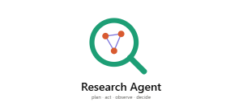
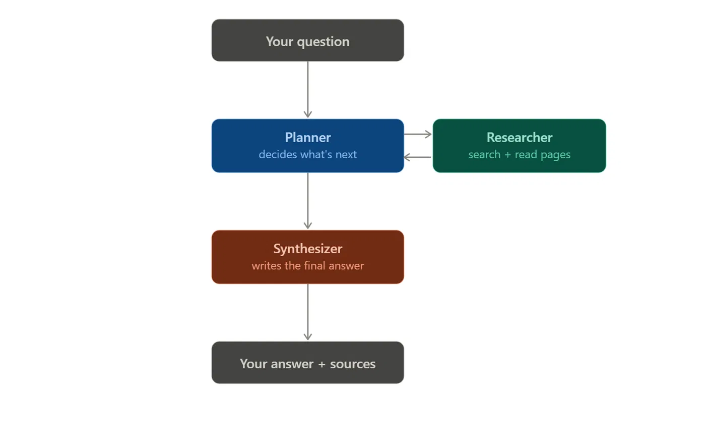

# Research Agent

A tool-calling web research agent built with LangGraph, with a
persistent, multi-conversation chat interface. The agent follows a
**plan → act → observe → decide** loop: it searches the web, reads
pages it finds useful, and decides for itself when it has enough
information to answer. Conversations, research, and sources are all
saved to disk, so everything survives closing the browser or
restarting the app.

## How the agent works



```
START -> planner --(tool calls?)--> researcher -> planner   (loop)
                 \--(no tool calls, or max iters)--> synthesizer -> END
```

- **`planner`** (Groq, `llama-3.3-70b-versatile`) — decides each turn
  whether it needs more information (calls a tool) or is ready to
  answer (replies `READY: ...`). Runs on Groq because it's called
  multiple times per question — Groq's free tier handles that
  high-frequency pattern better than most.
- **`researcher`** — executes whatever tool calls the planner
  requested, and extracts a structured `Source(title, url, snippet)`
  for every page actually read.
- **`synthesizer`** (Gemini, `gemini-2.5-pro`) — writes the final
  answer once per turn: explanation first, in plain and engaging
  language, then a short "In short:" summary at the end, then an
  invitation to go deeper on a specific part.

## Long-term memory (disk-persisted, survives restarts)

There are two separate SQLite files in `data/`, each with a distinct job:

| File                        | Holds                                                                                     | Used by                                                            |
| --------------------------- | ----------------------------------------------------------------------------------------- | ------------------------------------------------------------------ |
| `data/checkpoints.sqlite`   | The agent's reasoning state: raw messages, research notes, sources — keyed by `thread_id` | LangGraph's `SqliteSaver` checkpointer (`agent/graph.py`)          |
| `data/conversations.sqlite` | What you actually see: conversation titles, timestamps, a clean turn-by-turn transcript   | `agent/conversations.py`, read directly by `app.py` on every rerun |

Splitting these is deliberate: the checkpoint format is LangGraph's
internal state shape (not meant for display), while the conversations
table is exactly what the UI needs to redraw the chat — including
after a full page reload or an app restart, since it reads from disk
every time rather than trusting Streamlit's session state to survive.

**This replaces the earlier in-memory-only setup** — previously,
conversation history lived only in the running process's memory and
vanished on restart; now both the agent's memory and the visible chat
history are real files on disk from the first message onward.

### Multi-conversation sidebar

The sidebar lists every past conversation (title + newest-first),
separate from the currently-active one (shown in **bold**). "➕ New
conversation" clears the active thread without touching anything
already saved — a new row only gets created once you actually send a
first message.

### Cross-conversation topic linking

When you start a _new_ conversation, the first question is checked
against the titles/first-questions of all past conversations
(`agent/conversations.py::find_related_conversation`, simple keyword
overlap — no embeddings/vector DB, kept transparent and dependency-free).
If it looks like a continuation of an earlier, separate conversation,
the new thread is seeded with that conversation's research notes and
sources (`agent/graph.py::seed_research_from_thread`), and you'll see
a note like:

> This looks related to your earlier conversation _"What the Federal
> Reserve does"_ — I'll build on what was already found there.

### Auto-generated titles

Each new conversation gets a short title generated from its first
question (`agent/graph.py::generate_title`) — one cheap extra call to
the fast Groq planner model, made once per conversation, not once per
turn.

## Skills this demonstrates

- **Tool / function calling** — `web_search` and `read_page` bound to
  the planner LLM via `bind_tools`.
- **Stateful agent with loops** — `AgentState` persists across the
  planner ⇄ researcher loop _and_ across conversation turns _and_
  across app restarts, via the SQLite checkpointer.
- **Multi-step reasoning** — the planner searches, reads, and decides
  whether to search again before answering.
- **Grounding in real data** — the synthesizer is explicitly told to
  answer only from retrieved research notes, not prior knowledge.
- **Structured outputs** — `Source` is a typed dict; `sources` is a
  deduplicated list in state, rendered as clickable links.
- **Evaluation mindset** — `evaluation/test_questions.py` checks
  whether tool use matched expectation per question.

### Standout details

- **Visible intermediate steps** — the UI shows each search query and
  URL read live, with tool output in an expander.
- **Clickable sources, per-turn and per-conversation** — each answer
  shows only the sources found _that turn_; the sidebar shows every
  unique source found across the whole active conversation.
- **Graceful failure handling** — `web_search` retries once with a
  simplified query if the first attempt errors or comes back empty.
- **Long, engaging answers** — explanation first in plain language,
  summary last, ending with a tailored offer to go deeper.
- **Cost / rate-limit control** — high-frequency planning runs on
  Groq; the one-shot final write-up runs on stronger Gemini.
- **Real persistence** — conversations, research, and sources survive
  closing the browser or restarting the app; verified by actually
  killing and restarting the process during development, not just
  assumed.

## Project structure

```
research-agent/
├── app.py                 # Streamlit chat UI (sidebar, persistence, topic linking)
├── agent/
│   ├── graph.py             # LangGraph StateGraph + SQLite checkpointer + memory helpers
│   ├── tools.py               # web_search + read_page tools
│   ├── state.py                 # AgentState schema (incl. Source type)
│   ├── prompts.py                 # planner / synthesizer / title prompts
│   └── conversations.py             # disk-persisted conversation registry (titles, transcripts)
├── evaluation/
│   └── test_questions.py               # a handful of test cases
├── data/                     # created automatically — SQLite files live here
├── requirements.txt
├── .env.example
└── README.md
```

## Setup (with `uv`)

**1. Get free API keys:**

- Groq (planner): https://console.groq.com/keys
- Gemini (synthesizer + titles): https://aistudio.google.com/apikey

**2. Set up the Python environment:**

```bash
uv venv
source .venv/bin/activate        # Windows: .venv\Scripts\activate
uv pip install -r requirements.txt
cp .env.example .env             # then add GROQ_API_KEY and GOOGLE_API_KEY
```

## Run

**Streamlit chat UI (recommended):**

```bash
uv run streamlit run app.py
```

**CLI (single question, uses thread_id="default" — no sidebar/registry):**

```bash
uv run python -m agent.graph
```

**Evaluation suite:**

```bash
uv run python -m evaluation.test_questions
```

## Notes / things to tune

- `web_search` uses DuckDuckGo (`ddgs`) — free, no API key. Swap it
  for Tavily or SerpAPI in `agent/tools.py` for higher-quality results.
- `read_page` truncates page text to 8000 characters — tune in
  `agent/tools.py`.
- `MAX_ITERATIONS` (default 6) bounds the planner loop _within a
  single turn_ — tune if multi-hop questions get cut off.
- `PLANNER_MODEL` / `SYNTHESIZER_MODEL` control the cost/quality
  tradeoff. Groq's free tier is generous but not unlimited (check
  `console.groq.com/settings/limits`) — lower `MAX_ITERATIONS` if you
  still hit limits.
- `find_related_conversation`'s match threshold (default `0.3`, in
  `agent/conversations.py`) trades off false positives vs. missed
  connections — raise it if it links unrelated conversations, lower it
  if it misses real continuations.
- `research_notes` accumulates for the life of a _thread_ — for very
  long-running single conversations this means the synthesizer prompt
  keeps growing. Consider summarizing/trimming older notes if that
  becomes a problem.
- `DATA_DIR` (default `data/`) is where both SQLite files live — back
  this up or point it at a persistent volume in any deployment where
  the filesystem itself might be ephemeral (e.g. some container
  platforms reset local disk on redeploy).
